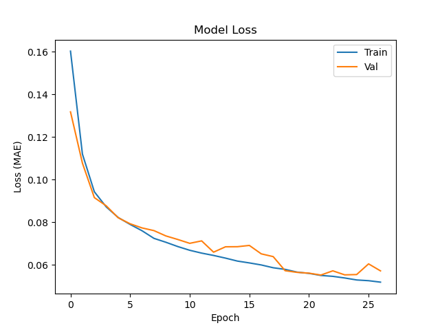
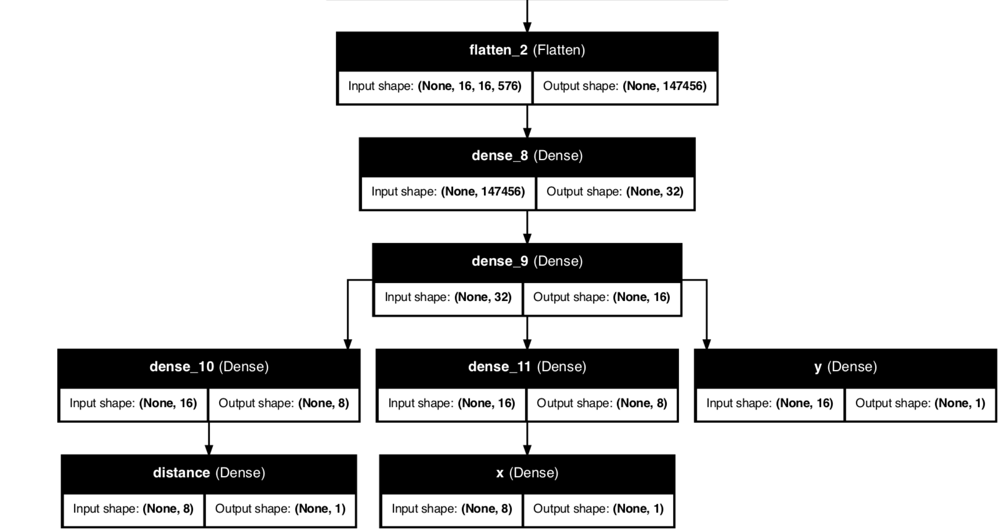
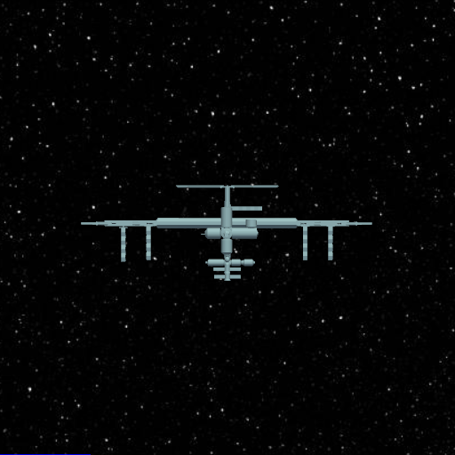

# HackAI 2025 | ISS AI Docking Locator and Distance Regressor

___

### Team

<u>LeTeam:</u> Neil Ghugare, Pranav Moola, Nishanth Kunchala, and Jacob Balek

___

### Acknowledgements

The data was collected on Kaggle, taken from a an AICrowd challenge dataset, located [here](https://www.kaggle.com/datasets/msafi04/iss-docking-dataset/data).

We used public-use STL files of the ISS and Dragon shuttle, located [here](https://www.thingiverse.com/thing:3570393#google_vignette) and [here](https://www.thingiverse.com/thing:4207259), respectively.

___

### HackAI 2025 Model

The HackAI 2025 model was created as a part of the 25-hour hackathon. We created a MHN regressing three values (distance, x-coordinate of the docking port, and y-coordinate of the docking port) through three separate heads. The backbone of the model was the `MobileNetV3Small` model provided by Keras. 

Alongside that, a 3D visualization of the model outputs was created using STL files of the ISS and SpaceX Dragon capsule (provided). 

___

[Back to Top](#hackai-2025--iss-ai-docking-locator-and-distance-regressor)

This page was last edited on 02.23.2025
